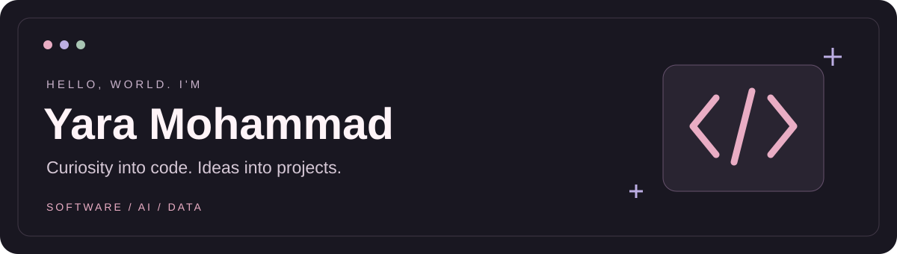

  

  <strong>Senior Computer Science Student · Effat University · Saudi Arabia</strong>

  <a href="https://iiyara.github.io/portfolio/">Portfolio</a> &nbsp;·&nbsp;
  <a href="https://www.linkedin.com/in/yara-mohammad-a09996334/">LinkedIn</a> &nbsp;·&nbsp;
  <a href="mailto:YaraMohammadSA@gmail.com">Email</a>

---

### A little about me

Hi, I'm Yara. I like turning an idea into something I can build, test, and improve—whether that's a website, a Java application, or an experiment with data.

I'm exploring **software development, AI, and data**, and using this space to share my projects and what I'm learning along the way.

**I'm looking for COOP and internship opportunities** where I can contribute, learn from a team, and keep building.

### Selected projects

| Project | What you'll find | Focus |
| :--- | :--- | :--- |
| [**Health Risk Prediction**](https://github.com/iiYARA/CS4082_health-prediction-distribution-shift) | A team study of how prediction performance changes across two health datasets, with a report, poster, and slides. | Machine learning · Evaluation |
| [**Fidak**](https://github.com/iiYARA/fidak-blood-donation-management-system) | A blood donation website with donor registration, blood group search, and an admin dashboard. | PHP · MySQL · Web development |
| [**JAS Hospital Management**](https://github.com/iiYARA/jas-hospital-management) | A C++ simulation using data structures to manage patients, emergency priorities, and treatment history. | C++ · Data structures |
| [**Personal Portfolio**](https://github.com/iiYARA/portfolio) | An interactive home for my education journey, projects, and skills. | React · TypeScript · Tailwind CSS |

<strong>More to explore</strong>

- [ATM Banking System](https://github.com/iiYARA/atm-banking-system) — a Java banking application with ATM transactions and an admin interface; source attribution and setup status are documented in the repository.
- [Smart Blood Donation Platform](https://github.com/iiYARA/smart-blood-donation-platform) — a software engineering project overview focused on requirements and system design.

### My toolkit

| Area | Technologies |
| :--- | :--- |
| Programming | Python · Java · C++ |
| Web | HTML · CSS · JavaScript · PHP |
| Data & tools | MySQL · Git · GitHub · Jupyter / Google Colab |

### Learning in public

- [**CS4082 · Machine Learning**](https://github.com/iiYARA/CS4082-Machine-Learning) — lab notebooks and the course project.
- [**CS4085 · Deep Learning**](https://github.com/iiYARA/CS4085-Deep-Learning) — labs, exercises, and an evolving project space.

---

<em>Have something interesting to build? <a href="mailto:YaraMohammadSA@gmail.com">Let's connect.</a></em>

